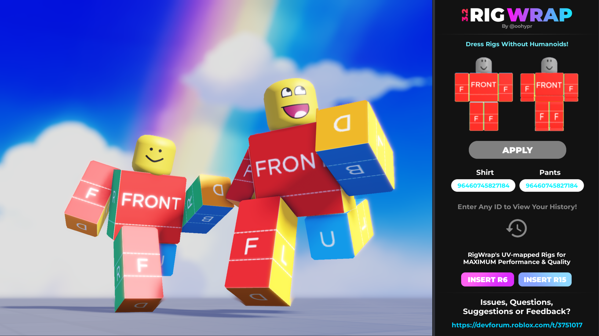

# **RigWrap — Official Documentation**
The modern solution to high-performance, non-Humanoid rig rendering.

 

## Introduction

**[RigWrap](https://create.roblox.com/store/asset/71774011419996)** is a **free [Roblox Plugin](https://create.roblox.com/docs/reference/engine/classes/Plugin)** made by **[@oohypr](https://www.roblox.com/users/3608456945/profile)** on June 17th, 2025.  
The plugin is currently at `Version 3.2` and has undergone continuous updates and maintenance, featuring major improvements in terms of **stability, efficiency, functionality and visual appearance**.
It serves as an **efficient workflow tool**, designed to **offer instant solutions** to several well-known problems in the Roblox Development Community by introducing the **solutions listed below**.

The purpose of RigWrap is to **maximize individual freedom and flexibility** in everyday development by eliminating the dependency on Roblox's **[Humanoid Instances](https://create.roblox.com/docs/reference/engine/classes/Humanoid)**. RigWrap enables developers to rely entirely on **performance-friendly [AnimationControllers](https://create.roblox.com/docs/reference/engine/classes/AnimationController)** for NPCs and Rigs while providing fast, modern visual rendering.  

Additionally, **RigWrap** not only provides a highly-efficient long-term solution to non-Humanoid **[Clothing](https://create.roblox.com/docs/avatar/classic-clothing)** rendering, but **significantly improves overall performance** through increased FPS, faster loading time, lower memory usage and lag **([View Benchmark](https://devforum-uploads.s3.dualstack.us-east-2.amazonaws.com/uploads/original/5X/5/6/e/d/56ed956f38135437d68c766880688c6a604866eb.mp4))** as well as enhanced rendering quality.  

If you are developing or contributing to experiences that feature NPCs, you should incorporate RigWrap into your workflow to benefit from all those improvements. If you encounter any issues during development, seek immediate contact with me or RigWrap's community.

# 1: Clothing on Rigs without Humanoids
RigWrap's original solution — to fix the problem of not being able to render clothing on NPCs without Humanoids.  
Instead of relying on traditional Humanoid-based clothing rendering, you can now rely on RigWrap. 

## *(Outdated)* **`v1.0 – v2.x` Rendering Approach:**  

RigWrap's original rendering approach was complex and unnefficient compared to `v3.x`, but offered a more efficient solution than Humanoid-based rendering. Back in 2025, RigWrap introduced **texture-based rendering**, which worked the following way:  
The plugin measured the individual dimensions of R6 & R15 clothing template components, stored the information internally and used a complex function to determine the exact U- and V-Offsets required to render the clothing precisely onto the rig's limbs. 
Although this approach solved our fundamental problem, it resulted in a much higher amount of draw cells due to each limb part requiring multiple textures for each face.

> *Texture-based rendering was removed in `v3.0`.*

## **New `v3.x` Modern Rendering Approach**:
RigWrap `v3.0` introduced an entirely new rendering technology.
Instead of relying on texture-cropping, RigWrap now relies on custom UV-mapped Rigs that allow you to render any given image on top.
No more complex functions, coordinate-storing, or issues with face rotations. It works by simply inserting an R6 or R15 Rig from the plugin directly, entering any [AssetID](https://create.roblox.com/docs/projects/assets) and clicking "Apply".

<ins> FaQ: **How do I get rid of black spots on my clothes?** </ins>

> This issue is known for clothes that have transparent areas. The black spots come from Roblox trying to render transparent pixels directly, which is not possible by solely using **MeshPart Instances**.   
RigWrap is forced into modifying the **TextureId properties** of its uv-mapped limb mesh parts by default. The solution to this problem is to render the Image by using **SurfaceAppearances**. However, plugins are prohibited from modyfing **SurfaceAppearance ColorMaps** at runtime.
By manually inserting **SurfaceAppearances** into each Rig limb part and changing their **ColorMap** properties, you can quickly work around this issue and turn all black spots transparent.
The issue does not come from RigWrap — it comes from Roblox directly.

# 2: High-Resolution Rendering
[Roblox Clothing Template](https://create.roblox.com/docs/avatar/classic-clothing) dimensions are exactly **585x559px**.  
RigWrap can render any Decal or Image on Rigs, resulting in an increased Resolution of up to **1024x1024px**.

# 3: Increased Overall Performance
RigWrap features the following performance improvements:  
- **Increased FPS**
- **Lower Memory Usage**
- **Shorter Loading Time**
- **Reduced Lag**

You can watch the outdated [`v2.x` **Benchmark Video**](https://devforum-uploads.s3.dualstack.us-east-2.amazonaws.com/uploads/original/5X/5/6/e/d/56ed956f38135437d68c766880688c6a604866eb.mp4).
Although I have not made a new benchmark yet, RigWrap `v3.x` offers significantly more performance.

# Important Links

**Creator Store - Download RigWrap**  
https://create.roblox.com/store/asset/71774011419996

**Developer Forum Post**  
https://devforum.roblox.com/t/3751017

# Appreciate RigWrap?
I am convinced that RigWrap efficiently solves multiple well-known problems in the **Roblox Development Community** and deserves to be some day known as a popular must-have plugin, therefore I encourage every developer to give RigWrap a chance.
If you happen to encounter any issues, please seek immediate contact with me through the **Developer Forum**.  
However, if you had a positive experience with RigWrap, please consider supporting the plugin in any of these ways:

### ❤️ Upvote RigWrap inside your Toolbox
This, together with writing a review on the Creator Store, has by far the highest impact on Roblox's algorithm to introduce RigWrap to more developers. Due to the tiny amount of developers who have shown their opinion on RigWrap by upvoting it inside their Toolbox, you can make a significant change in RigWrap's rating and popularity with a single vote.  
I highly appreciate everyone who takes a minute to open RigWrap inside their Toolbox and presses the like button!

**Furthermore, you could...**

- Leave a positive review on the [Creator Store](https://create.roblox.com/store/asset/71774011419996)
- Write a post below the Dev Forum Topic (You can provide feedback or even feature suggestions!)
- Share or recommend RigWrap to other Developers
- Donate a small amount of Robux [here](https://www.roblox.com/games/93645174178810/Baseplate#!/store) to help fund some of the development
